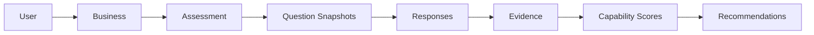

# PBHS Core v1 Architecture Summary

## Purpose

This document summarizes the frozen PBHS Core v1 implementation completed across M13-M17.

It records implemented scope, deferred scope, known technical debt, and extension points for M18+.

## Core Architecture

PBHS Core v1 is a deterministic backend decision-support pipeline implemented with:

- FastAPI REST API.
- SQLAlchemy persistence.
- SQLite-compatible database models and migrations.
- Repository layer around domain persistence.
- Service layer for assessment workflow, scoring, and recommendations.
- Pydantic API schemas.
- Automated backend tests for assessment, scoring, and recommendation workflows.

Implemented flow:

```text
Assessment -> Evidence -> Capability Scores -> Recommendation Engine
```

Expanded flow:



## Implemented Scope

### M13 Project Setup

Implemented:

- FastAPI backend scaffold.
- React/Vite frontend scaffold.
- SQLite migration scaffold.
- Shared TypeScript package scaffold.
- Health endpoint.
- OpenAPI support through FastAPI.
- Initial pytest setup.

### M14 Domain Model and Persistence

Implemented:

- User model.
- Business model.
- PBHS Assessment model.
- PBHS Question model.
- PBHS Response model.
- Evidence Item model.
- Repository interfaces and SQLAlchemy repositories.
- Initial persistence and migrations.

### M15 Assessment Engine

Implemented:

- Assessment creation for a Business.
- Snapshotting active PBHS questions into assessment-specific question snapshots.
- Draft-only response submission.
- Response validation against assessment question snapshots.
- Response update behavior for draft assessments.
- Self-report Evidence Item creation and update from responses.
- Assessment progress calculation.
- Assessment submission and lock lifecycle.
- Assessment workflow API endpoints.
- Assessment workflow tests.

### M16 Scoring Engine

Implemented:

- Deterministic scoring service.
- `likert_1_5` normalization to 0-100.
- Capability Score persistence.
- Overall assessment score.
- Overall assessment confidence.
- Maturity levels 1-5.
- Evidence provenance for every Capability Score.
- Idempotent rescoring.
- Assessment transition from `submitted` to `scored`.
- Scoring API endpoints.
- Scoring tests.

### M17 Recommendation Engine

Implemented:

- Deterministic recommendation service.
- Rule and template architecture in code.
- Five recommendation types:
  - `SPONSOR_READINESS`
  - `CONTENT_SYSTEM`
  - `EMAIL_FUNNEL`
  - `AUTOMATION`
  - `KNOWLEDGE_LIBRARY`
- Recommendation persistence.
- Rule matching against Capability Scores.
- Recommendation instantiation with:
  - expected Business Return
  - expected Life Return
  - Human Time estimates
  - Human Signature impact
  - confidence
  - risk
  - priority
  - rationale
  - calculation trace
  - evidence provenance
  - success criteria
- Idempotent recommendation regeneration.
- Internal supersession of recommendations no longer generated.
- Assessment transition from `scored` to `recommendations_generated`.
- Recommendation API endpoints.
- Recommendation tests.

## Canonical Contract Documents

The PBHS Core v1 contract is frozen in:

- `Implementation/API/PBHS_API_v1.md`
- `Implementation/PBHS_Domain_Model_v1.md`
- `Implementation/PBHS_State_Machine_v1.md`
- `Implementation/PBHS_Core_v1_Architecture_Summary.md`

## Implemented API Boundary

The public domain API is mounted at:

```text
/api/v1
```

Implemented resource groups:

- Users.
- Businesses.
- PBHS Questions.
- Assessments.
- Assessment Question Snapshots.
- Responses.
- Evidence.
- Capability Scores.
- Recommendations.

The implemented health endpoint is:

```text
/health
```

## Implemented Lifecycle

Assessment:

```text
draft -> submitted -> scored -> recommendations_generated
```

Recommendation:

```text
candidate
```

Internal regeneration may mark recommendations:

```text
superseded
```

## Implemented Persistence Boundary

Implemented tables:

- `users`
- `businesses`
- `pbhs_assessments`
- `pbhs_questions`
- `pbhs_assessment_questions`
- `pbhs_responses`
- `evidence_items`
- `capability_scores`
- `recommendations`

Not implemented as persisted tables:

- Recommendation generation runs.
- Executive reports.
- Business Owner decisions.
- Executive Board review records.
- Strategy or execution objects.

## Implemented Determinism Guarantees

PBHS Core v1 provides these deterministic properties:

- Assessment snapshots preserve historical question text, version, capability, construct, response scale, and source status.
- Response validation uses snapshots rather than mutable source questions.
- Scoring uses snapshots rather than mutable source questions.
- Scoring is idempotent by assessment and capability.
- Recommendation generation is idempotent by assessment and recommendation type.
- Recommendations include rule, rule version, template, template version, engine version, rule set version, rationale, calculation trace, capability score IDs, and evidence IDs.

## Deferred Scope

The following are intentionally outside PBHS Core v1:

### Product and Workflow

- Executive reports.
- Dashboard experience beyond frontend shell.
- Business Owner decisions.
- Recommendation review workflow.
- Recommendation approval, rejection, or deferment workflow.
- Recommendation execution tracking.
- Conversion of recommendations into objectives, initiatives, projects, or workflows.

### Governance

- Executive Board.
- Executive Agent review.
- Multi-perspective recommendation evaluation.
- Human approval gates beyond the existence of candidate recommendations.

### Identity and Access

- Authentication.
- Authorization.
- Organizations.
- Teams.
- Roles and permissions.
- API keys or OAuth.

### Evidence and Intelligence

- External evidence ingestion.
- Behavioral evidence collection.
- Business metric evidence collection.
- Portfolio evidence collection.
- AI interview evidence collection.
- Longitudinal evidence collection.
- Cross-assessment trends.

### Persistence and Operations

- Persisted recommendation generation runs.
- Audit log.
- Event log.
- Background jobs.
- Production database hardening.
- Observability, metrics, and tracing.

## Known Technical Debt

### API Consistency

- Recommendation endpoints use the `/api/v1/pbhs/assessments/...` prefix while assessment scoring endpoints use `/api/v1/assessments/...`.
- Earlier draft API documentation mentions unimplemented report endpoints and an older recommendation generation URL. PBHS Core v1 freezes the implemented URLs, not those draft URLs.

### Authentication Gap

- User and Business ownership are persisted, but access control is not enforced.
- All endpoints operate without authentication.

### Admin Boundary

- PBHS Question creation is exposed as a public v1 endpoint.
- There is no separate administrative boundary for managing question-bank data.

### Validation Split

- The Assessment Engine accepts and validates `likert_1_7`, `yes_no`, and `text` response scales.
- The Scoring Engine supports `likert_1_5` only.
- Assessments containing non-`likert_1_5` scored questions cannot be scored by Core v1.

### Evidence Endpoint Behavior

- Listing assessment evidence does not explicitly check whether the assessment exists.
- Unknown assessment IDs return an empty evidence list rather than `assessment_not_found`.

### Generation Run Persistence

- Recommendation generation run data is returned by the API but is not persisted as its own table.
- The run ID is deterministic text derived from assessment ID and engine version.

### Rule and Template Storage

- Recommendation rules and templates are code-defined constants.
- They are versioned in code but not stored in database-managed configuration tables.

### Reserved Enum Values

- Assessment and recommendation enums include future lifecycle values that are not transitioned by Core v1.
- Documentation must distinguish implemented lifecycle from reserved enum capacity.

### Infrastructure Maturity

- SQLite-compatible persistence is suitable for MVP validation.
- Production-grade database configuration, migrations policy, backups, and operational controls remain future work.

### Upstream Warning

- Existing changelog notes a non-blocking upstream FastAPI/Starlette `httpx` deprecation warning.

## Extension Points for M18+

### Executive Report Extension

Natural extension:

```text
recommendations_generated -> reported
```

Likely additions:

- Report generation service.
- Report persistence model.
- Report API endpoints.
- Report templates.
- Report snapshot/version policy.

### Business Owner Decision Extension

Natural extension:

```text
candidate -> reviewed -> approved | rejected | deferred
```

Likely additions:

- Decision model.
- Decision API endpoints.
- Decision rationale.
- Owner notes.
- Decision timestamp.
- Recommendation status transition guards.

### Executive Board Extension

Likely additions:

- Executive review model.
- Executive Agent perspectives.
- Multi-perspective recommendation evaluation.
- Review status.
- Governance trace.

### Strategy and Execution Extension

Natural extension from approved recommendations:

```text
approved recommendation -> objective -> initiative/project -> workflow
```

Likely additions:

- Objective model.
- Initiative model.
- Project model.
- Department assignment.
- Execution tracking.
- Outcome measurement.

### Evidence Extension

Natural extension:

```text
self_report evidence + external evidence -> stronger confidence
```

Likely additions:

- External evidence ingestion endpoints.
- Evidence source adapters.
- Evidence quality scoring.
- Business metric evidence.
- Portfolio evidence.
- Behavioral evidence.
- AI interview evidence.
- Longitudinal evidence.

### Recommendation Engine Extension

Likely additions:

- Persisted generation runs.
- Database-managed rule sets.
- Database-managed templates.
- Rule-set activation and rollback.
- A/B rule evaluation.
- Explainability improvements.
- Recommendation portfolio optimization.

### API Extension

Likely additions:

- New `/api/v2` path for breaking changes.
- Authentication and authorization.
- Admin-only question management.
- Pagination and filtering.
- API-level idempotency keys where needed.
- Consistent resource path conventions.

## Architecture Freeze Statement

PBHS Core v1 is frozen as the first implemented analytical core of PBOS.

It does not implement the full PBOS operating system. It establishes the stable contract for assessment capture, evidence preservation, deterministic scoring, and deterministic recommendation generation.

Future milestones should extend this core without changing the meaning of the frozen v1 contract.

