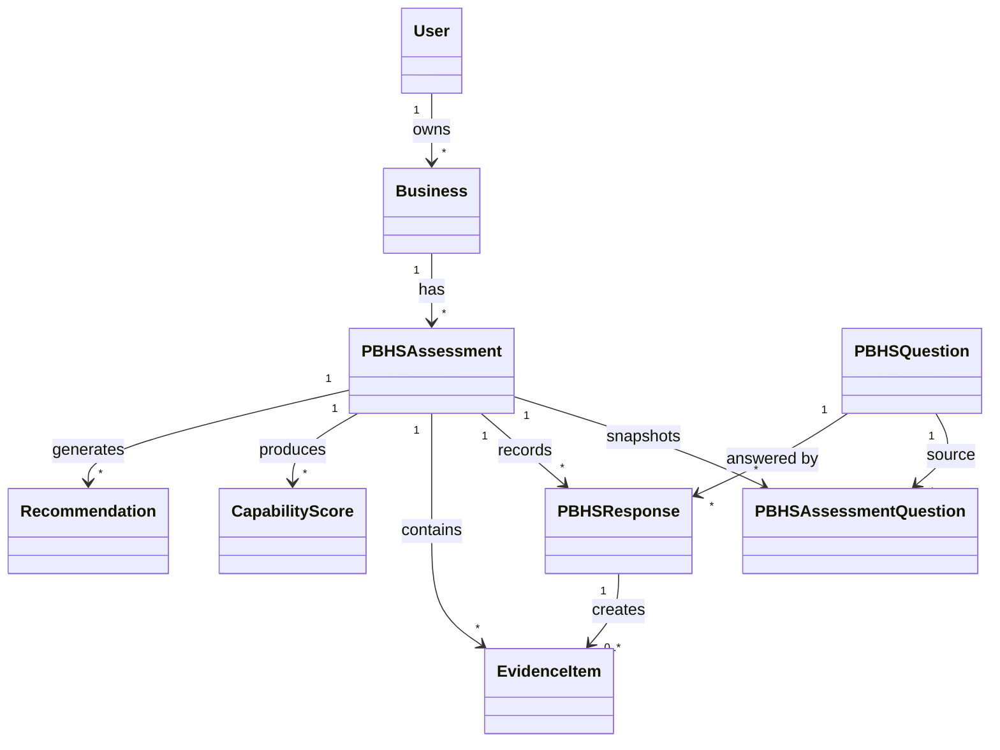

# PBHS Core v1 Domain Model

## Purpose

This document freezes the implemented PBHS Core v1 domain model.

It documents only domain objects that exist in the backend implementation at the end of M17. Future PBOS concepts are named only where needed to mark deferred scope.

## Domain Boundary

PBHS Core v1 implements the analytical core of PBHS:

```text
Business Owner -> Business -> Assessment -> Evidence -> Capability Scores -> Recommendations
```

The domain is deterministic, evidence-preserving, and version-aware.

## Aggregate Overview



## User

### Meaning

`User` represents the person who owns one or more businesses in the implemented PBHS Core v1 system.

In product language, this is the Business Owner. The implementation uses the neutral name `User`.

### Fields

| Field | Type | Required | Notes |
| --- | --- | --- | --- |
| `user_id` | UUID string | Yes | Primary identity. |
| `name` | string | Yes | Max 200 characters. |
| `email` | string | Yes | Max 320 characters. Unique. |
| `created_at` | datetime | Yes | Created timestamp. |

### Relationships

- A User owns zero or more Businesses.
- A Business must belong to one User.

### Ownership

User is the ownership root for Business records in PBHS Core v1.

Authentication is not implemented. User identity is stored but not used for access control.

## Business

### Meaning

`Business` represents the PBOS business profile being assessed by PBHS.

### Fields

| Field | Type | Required | Notes |
| --- | --- | --- | --- |
| `business_id` | UUID string | Yes | Primary identity. |
| `user_id` | UUID string | Yes | Owner reference. |
| `name` | string | Yes | Max 200 characters. |
| `industry` | string | Yes | Max 200 characters. |
| `created_at` | datetime | Yes | Created timestamp. |
| `business_stage` | string or null | No | Optional profile attribute. |
| `primary_business_model` | string or null | No | Optional profile attribute. |
| `vision_of_life_version` | string or null | No | Version pointer only. The Vision of Life entity is not implemented. |
| `business_vision_version` | string or null | No | Version pointer only. The Business Vision entity is not implemented. |

### Relationships

- A Business belongs to exactly one User.
- A Business may have many PBHS Assessments.

### Ownership

Business owns the PBHS assessment history for that business profile.

## PBHS Question

### Meaning

`PBHSQuestion` is the reusable source question definition in the question bank.

Although not listed as a requested top-level object, it is implemented and is required to understand Assessment Question Snapshots.

### Fields

| Field | Type | Required | Notes |
| --- | --- | --- | --- |
| `question_id` | UUID string | Yes | Primary identity. |
| `capability` | string | Yes | Capability measured by the question. |
| `construct` | string | Yes | Construct measured inside the capability. |
| `question_text` | string | Yes | Max 1000 characters. |
| `response_scale` | string | Yes | Implemented response validation supports `likert_1_5`, `likert_1_7`, `yes_no`, and `text`; scoring supports `likert_1_5` only. |
| `version` | string | Yes | Question version. |
| `status` | enum | Yes | `active`, `experimental`, or `retired`. |

### Relationships

- A PBHS Question may be snapshotted into many assessments.
- A PBHS Question may have many Responses across assessments.

### Ownership

Questions are system-owned reference data.

Only active questions are snapshotted into new assessments.

## Assessment

### Meaning

`PBHSAssessment` represents one assessment session for a Business.

It is the central lifecycle object in PBHS Core v1.

### Fields

| Field | Type | Required | Notes |
| --- | --- | --- | --- |
| `assessment_id` | UUID string | Yes | Primary identity. |
| `business_id` | UUID string | Yes | Parent Business. |
| `pbhs_version` | string | Yes | PBHS version selected at assessment start. |
| `status` | enum | Yes | Implemented lifecycle uses `draft`, `submitted`, `scored`, `recommendations_generated`. |
| `created_at` | datetime | Yes | Created timestamp. |
| `completed_at` | datetime or null | No | Set when submitted. |
| `overall_score` | float or null | No | Set by scoring. |
| `overall_confidence` | float or null | No | Set by scoring. |
| `scoring_method` | string or null | No | Set to `pbhs_questionnaire_v1` by scoring. |
| `scored_at` | datetime or null | No | Set by scoring. |

### Relationships

- An Assessment belongs to one Business.
- An Assessment owns many Assessment Question Snapshots.
- An Assessment owns many Responses.
- An Assessment owns many Evidence Items.
- An Assessment owns many Capability Scores.
- An Assessment owns many Recommendations.

### Ownership

Assessment is the aggregate root for the implemented PBHS analytical pipeline.

Responses, evidence, scores, and recommendations are scoped to one Assessment.

## Assessment Question Snapshot

### Meaning

`PBHSAssessmentQuestion` is an immutable snapshot of a PBHS Question at the moment an assessment starts.

It protects historical assessments from later question-bank changes.

### Fields

| Field | Type | Required | Notes |
| --- | --- | --- | --- |
| `assessment_question_id` | UUID string | Yes | Primary identity. |
| `assessment_id` | UUID string | Yes | Parent Assessment. |
| `question_id` | UUID string | Yes | Source PBHS Question. |
| `question_version` | string | Yes | Source question version at snapshot time. |
| `capability` | string | Yes | Copied from source question. |
| `construct` | string | Yes | Copied from source question. |
| `question_text` | string | Yes | Copied from source question. |
| `response_scale` | string | Yes | Copied from source question. |
| `required` | boolean | Yes | Implemented snapshots are required by default. |
| `order_index` | integer | Yes | Order assigned at assessment start. |
| `source_status` | string | Yes | Source question status at snapshot time. |
| `created_at` | datetime | Yes | Snapshot timestamp. |

### Relationships

- A Snapshot belongs to one Assessment.
- A Snapshot references one source PBHS Question.
- Responses are validated against the Snapshot, not the live source question.
- Scoring uses the Snapshot, not the live source question.

### Ownership

Assessment owns its snapshots.

## Response

### Meaning

`PBHSResponse` stores one answer to one assessment question.

### Fields

| Field | Type | Required | Notes |
| --- | --- | --- | --- |
| `response_id` | UUID string | Yes | Primary identity. |
| `assessment_id` | UUID string | Yes | Parent Assessment. |
| `question_id` | UUID string | Yes | Source question answered. |
| `question_version` | string | Yes | Version from the assessment snapshot. |
| `response_value` | JSON | Yes | Value validated against the snapshot response scale. |
| `submitted_at` | datetime | Yes | Submission or latest update timestamp. |

### Constraints

- One Response per `(assessment_id, question_id)`.
- Responses can only be created or updated while the Assessment is `draft`.
- Updating a draft response reuses the same Response identity.

### Relationships

- A Response belongs to one Assessment.
- A Response references one PBHS Question.
- A Response may create or update one Evidence Item.

### Ownership

Assessment owns Responses.

## Evidence

### Meaning

`EvidenceItem` stores provenance used by scoring and recommendations.

PBHS Core v1 creates evidence automatically from self-report responses.

### Fields

| Field | Type | Required | Notes |
| --- | --- | --- | --- |
| `evidence_id` | UUID string | Yes | Primary identity. |
| `assessment_id` | UUID string | Yes | Parent Assessment. |
| `response_id` | UUID string or null | No | Response that produced the evidence. |
| `evidence_source` | enum | Yes | Core v1 creates `self_report`. Other enum values are reserved. |
| `related_capability` | string | Yes | Capability supported by the evidence. |
| `source_reference` | string | Yes | For response evidence: `pbhs_response:{question_id}`. |
| `evidence_value` | JSON | Yes | Evidence value. |
| `confidence` | float | Yes | Range 0.0-1.0. Self-report evidence is created with 1.0. |
| `created_at` | datetime | Yes | Created timestamp. |

### Relationships

- Evidence belongs to one Assessment.
- Evidence may link to one Response.
- Capability Scores store the Evidence IDs used in calculation.
- Recommendations store supporting Evidence IDs through the generated rationale and evidence link fields.

### Ownership

Assessment owns Evidence.

## Capability Score

### Meaning

`CapabilityScore` represents the deterministic score for one capability inside one assessment.

### Fields

| Field | Type | Required | Notes |
| --- | --- | --- | --- |
| `capability_score_id` | UUID string | Yes | Primary identity. |
| `assessment_id` | UUID string | Yes | Parent Assessment. |
| `capability` | string | Yes | Capability scored. |
| `score` | float | Yes | Range 0.0-100.0. |
| `maturity_level` | integer | Yes | Range 1-5. |
| `confidence` | float | Yes | Range 0.0-1.0. |
| `calculation_method` | string | Yes | `pbhs_questionnaire_v1`. |
| `evidence_ids` | list of UUID strings | Yes | Evidence used for the score. |
| `created_at` | datetime | Yes | Created timestamp. |
| `scored_at` | datetime | Yes | Score timestamp. |

### Constraints

- One Capability Score per `(assessment_id, capability)`.
- Scoring is idempotent and updates existing capability scores.
- Scoring supports `likert_1_5` responses only.

### Calculation

Implemented scoring:

- Normalize `likert_1_5` to 0-100:
  - 1 -> 0
  - 2 -> 25
  - 3 -> 50
  - 4 -> 75
  - 5 -> 100
- Capability score is the mean normalized score for the capability.
- Overall assessment score is the mean of capability scores.
- Questionnaire-only source breadth factor is 0.4.

Maturity levels:

| Score range | Maturity level |
| --- | ---: |
| `0 <= score <= 20` | 1 |
| `20 < score <= 40` | 2 |
| `40 < score <= 60` | 3 |
| `60 < score <= 80` | 4 |
| `80 < score <= 100` | 5 |

### Relationships

- Capability Score belongs to one Assessment.
- Capability Score references Evidence IDs.
- Recommendations reference Capability Score IDs.

### Ownership

Assessment owns Capability Scores.

## Recommendation

### Meaning

`Recommendation` represents a deterministic candidate recommendation generated from capability scores.

Core v1 recommendations are decision-support candidates. They do not execute themselves and do not represent owner approval.

### Fields

| Field | Type | Required | Notes |
| --- | --- | --- | --- |
| `recommendation_id` | UUID string | Yes | Primary identity. |
| `assessment_id` | UUID string | Yes | Parent Assessment. |
| `rule_id` | string | Yes | Rule that generated the recommendation. |
| `rule_version` | string | Yes | Rule version. |
| `template_id` | string | Yes | Template used for instantiation. |
| `template_version` | string | Yes | Template version. |
| `recommendation_type` | enum | Yes | Stable recommendation type. |
| `category` | enum | Yes | Recommendation category. |
| `title` | string | Yes | Human-readable title. |
| `description` | string | Yes | Human-readable description. |
| `priority` | string | Yes | `critical`, `high`, `medium`, `low`, or `deferred`. |
| `priority_score` | float | Yes | Range 0.0-100.0. |
| `priority_rationale` | string | Yes | Explanation of priority. |
| `confidence` | float | Yes | Range 0.0-1.0. |
| `confidence_label` | string | Yes | Derived label. |
| `risk_score` | float | Yes | Range 0.0-1.0. |
| `risk_label` | string | Yes | Derived label. |
| `expected_business_return` | JSON object | Yes | Structured expected Business Return. |
| `expected_life_return` | JSON object | Yes | Structured expected Life Return. |
| `human_time_required` | JSON object | Yes | Estimated Human Time required and saved. |
| `human_signature_impact` | JSON object | Yes | Impact on Human Signature. |
| `triggered_capabilities` | list of strings | Yes | Capabilities that triggered the recommendation. |
| `capability_score_ids` | list of UUID strings | Yes | Capability scores used. |
| `supporting_evidence_ids` | list of UUID strings | Yes | Evidence supporting the recommendation. |
| `rationale` | JSON object | Yes | Generated rationale. |
| `calculation_trace` | JSON object | Yes | Engine, rule, template, input, and score trace. |
| `recommended_execution_path` | enum | Yes | `DIY`, `DWY`, or `DFY`. |
| `success_criteria` | list of strings | Yes | Suggested success criteria. |
| `status` | enum | Yes | Generated as `candidate`; may be internally marked `superseded`. |
| `created_at` | datetime | Yes | Created timestamp. |
| `generated_at` | datetime | Yes | Generation timestamp. |

### Implemented Recommendation Types

- `SPONSOR_READINESS`
- `CONTENT_SYSTEM`
- `EMAIL_FUNNEL`
- `AUTOMATION`
- `KNOWLEDGE_LIBRARY`

### Constraints

- One Recommendation per `(assessment_id, recommendation_type)`.
- Recommendation generation is deterministic and idempotent by recommendation type.
- Regeneration updates existing recommendations of matching type.
- Existing recommendations whose type no longer matches generated rules are marked `superseded`.

### Relationships

- Recommendation belongs to one Assessment.
- Recommendation references Capability Score IDs.
- Recommendation references supporting Evidence IDs.

### Ownership

Assessment owns Recommendations.

## Value Objects

PBHS Core v1 implements value-object behavior primarily through enums, constrained fields, and structured JSON objects.

### AssessmentStatus

Implemented lifecycle values:

- `draft`
- `submitted`
- `scored`
- `recommendations_generated`

Reserved enum values not transitioned by Core v1:

- `reviewed`
- `reported`

### QuestionStatus

- `active`
- `experimental`
- `retired`

Only active questions are snapshotted into new assessments.

### EvidenceSource

Implemented created source:

- `self_report`

Reserved enum values:

- `behavioral`
- `business`
- `portfolio`
- `ai_interview`
- `longitudinal`

### RecommendationStatus

Implemented generation state:

- `candidate`

Implemented internal regeneration state:

- `superseded`

Reserved decision workflow states:

- `reviewed`
- `approved`
- `rejected`
- `deferred`

### RecommendationExecutionPath

- `DIY`
- `DWY`
- `DFY`

### RecommendationCategory

- `strategic`
- `operational`
- `asset`
- `ai_leverage`
- `commercial`
- `life_return`

### RecommendationType

- `SPONSOR_READINESS`
- `CONTENT_SYSTEM`
- `EMAIL_FUNNEL`
- `AUTOMATION`
- `KNOWLEDGE_LIBRARY`

### ResponseScale

Implemented response validation supports:

- `likert_1_5`
- `likert_1_7`
- `yes_no`
- `text`

Implemented scoring supports:

- `likert_1_5`

### Scores

Score ranges:

- Capability score: 0.0-100.0
- Overall score: 0.0-100.0
- Priority score: 0.0-100.0
- Confidence: 0.0-1.0
- Risk score: 0.0-1.0
- Maturity level: 1-5

### Structured Recommendation Value Objects

Recommendations store the following structured JSON value objects:

- `expected_business_return`
- `expected_life_return`
- `human_time_required`
- `human_signature_impact`
- `rationale`
- `calculation_trace`

These are implemented as JSON dictionaries rather than separate persisted entities.

## Ownership Summary

```text
User
  owns Business

Business
  owns Assessment history

Assessment
  owns Question Snapshots
  owns Responses
  owns Evidence
  owns Capability Scores
  owns Recommendations
```

## Deferred Domain Scope

The following domain concepts are not implemented as PBHS Core v1 entities:

- Authentication account, session, organization, team, role, or permission.
- Vision of Life entity.
- Business Vision entity.
- Executive Report.
- Business Owner Decision.
- Executive Board review.
- Strategy, Objective, Initiative, Project, Department, AI Employee, or Workflow.
- External evidence source ingestion.
- Recommendation execution tracking.
- Longitudinal trend model.
- Recommendation generation run persistence. The generation run exists as a response summary object, not as a database table.

