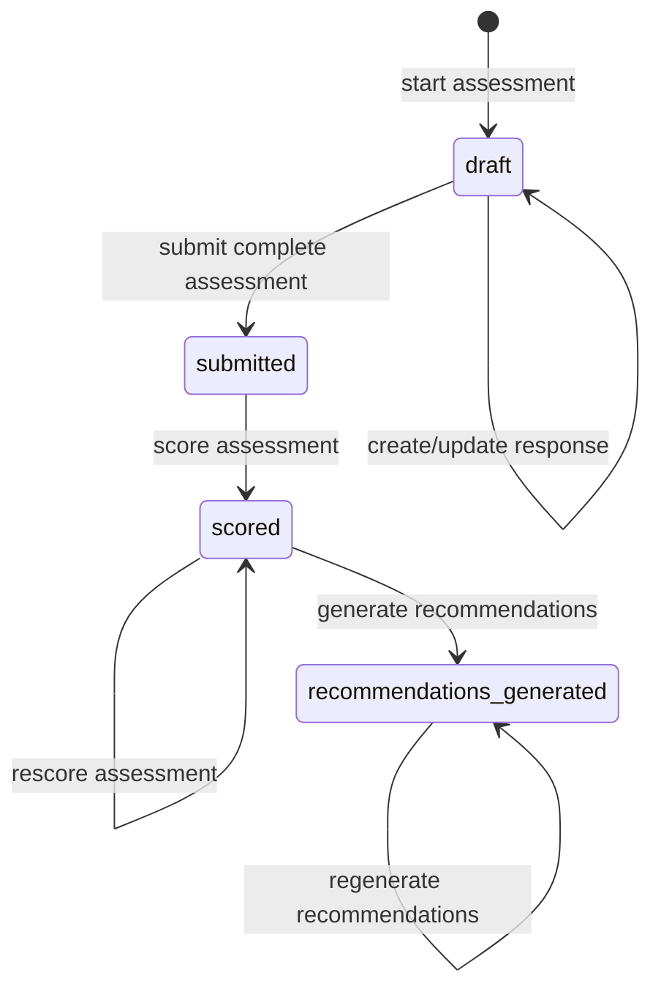
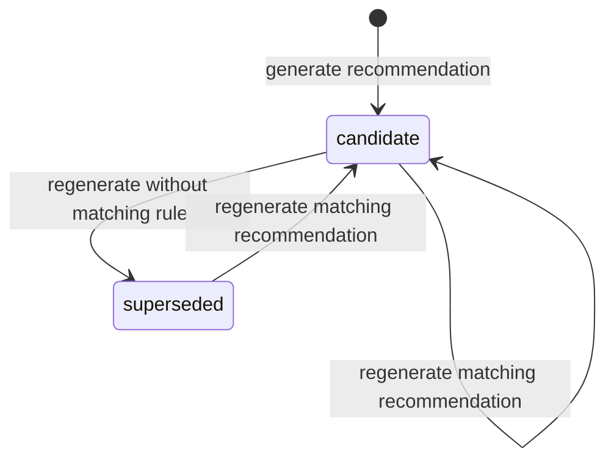
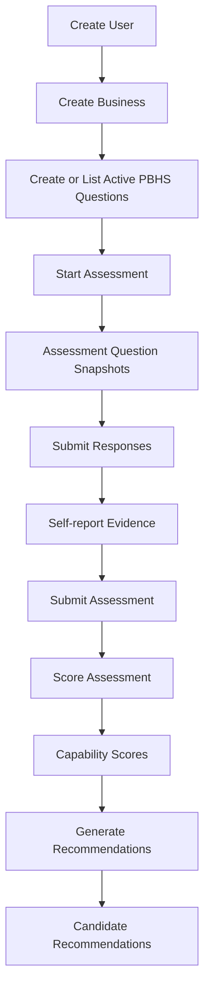

# PBHS Core v1 State Machine

## Purpose

This document freezes the implemented PBHS Core v1 lifecycle.

It describes valid transitions implemented by the backend at the end of M17. Enum values reserved for future milestones are marked as deferred and are not part of the Core v1 lifecycle.

## Assessment State Machine

### Implemented States

| State | Meaning |
| --- | --- |
| `draft` | Assessment has been created and active PBHS questions have been snapshotted. Responses may be created or updated. |
| `submitted` | Assessment responses are complete and locked. No further response changes are allowed. |
| `scored` | Capability scores and the overall assessment score have been calculated. |
| `recommendations_generated` | Candidate recommendations have been generated from the scored assessment. |

### Implemented Transitions



### Transition Table

| From | Action | To | Endpoint | Conditions |
| --- | --- | --- | --- | --- |
| none | Start assessment | `draft` | `POST /api/v1/businesses/{business_id}/assessments` | Business exists. Active questions are snapshotted. |
| `draft` | Submit response | `draft` | `POST /api/v1/assessments/{assessment_id}/responses` | Question exists in assessment snapshot. Response value validates against snapshot response scale. |
| `draft` | Submit assessment | `submitted` | `POST /api/v1/assessments/{assessment_id}/submit` | Assessment has at least one required question and all required questions are answered. |
| `submitted` | Score assessment | `scored` | `POST /api/v1/assessments/{assessment_id}/score` | Required evidence exists. All scoreable responses use supported scoring scale. |
| `scored` | Score assessment again | `scored` | `POST /api/v1/assessments/{assessment_id}/score` | Idempotent rescore updates existing capability scores. |
| `scored` | Generate recommendations | `recommendations_generated` | `POST /api/v1/pbhs/assessments/{assessment_id}/recommendations/generate` | At least one recommendation rule matches persisted capability scores. |
| `recommendations_generated` | Generate recommendations again | `recommendations_generated` | `POST /api/v1/pbhs/assessments/{assessment_id}/recommendations/generate` | Idempotent regeneration updates matching recommendations and may supersede non-matching ones. |

## Assessment Locking

Assessment locking is status-based.

```text
locked = assessment.status != draft
```

Only `draft` assessments accept response creation or updates.

Once an assessment is submitted:

- Responses are locked.
- Evidence created from responses remains available.
- Scoring may proceed.
- Progress still reports completion and `locked: true`.

## Assessment Guards

### Start Assessment

Guard:

- Business must exist.

Effects:

- Assessment is created with status `draft`.
- All active PBHS questions are copied into Assessment Question Snapshots.
- Snapshot order is assigned by active question enumeration.
- Snapshots preserve question text, version, capability, construct, response scale, required flag, and source status.

### Submit Response

Guard:

- Assessment must exist.
- Assessment must be `draft`.
- Question must exist in the assessment snapshot.
- Response value must validate against the snapshot response scale.

Effects:

- A new response is created, or an existing response for the same assessment and question is updated.
- A self-report Evidence Item is created or updated.
- Evidence confidence is set to `1.0`.
- Evidence source is `self_report`.

### Submit Assessment

Guard:

- Assessment must be `draft`.
- Assessment must have at least one required question.
- All required questions must have responses.

Effects:

- Assessment status becomes `submitted`.
- `completed_at` is set.
- Responses become locked.

### Score Assessment

Guard:

- Assessment must exist.
- Assessment status must be `submitted` or `scored`.
- All required responses and evidence must exist.
- Responses used for scoring must use `likert_1_5`.

Effects:

- Capability Scores are created or updated.
- Overall score is calculated.
- Overall confidence is calculated.
- `scoring_method` is set to `pbhs_questionnaire_v1`.
- `scored_at` is set.
- Assessment status becomes `scored`.

### Generate Recommendations

Guard:

- Assessment must exist.
- Assessment status must be `scored` or `recommendations_generated`.
- Capability Scores must exist.
- At least one recommendation rule must match.

Effects:

- Matching recommendations are created or updated.
- Existing recommendations whose type no longer matches generated rules are marked `superseded`.
- Assessment status becomes `recommendations_generated`.
- A non-persisted generation run summary is returned in the API response.

## Recommendation State Machine

### Implemented State

| State | Meaning |
| --- | --- |
| `candidate` | Recommendation has been generated as a decision-support candidate. |

### Implemented Internal Regeneration State

| State | Meaning |
| --- | --- |
| `superseded` | Existing recommendation no longer matches generated recommendation rules during regeneration. |

### Implemented Transitions



### Recommendation Transition Table

| From | Action | To | Conditions |
| --- | --- | --- | --- |
| none | Generate matching recommendation | `candidate` | Assessment is scored and a rule matches. |
| `candidate` | Regenerate matching recommendation | `candidate` | Same recommendation type still matches. Existing record is updated. |
| `candidate` | Regenerate without matching rule | `superseded` | Existing recommendation type is absent from new generated set. |
| `superseded` | Regenerate matching recommendation | `candidate` | Recommendation type matches again and record is updated. |

## Full Implemented Pipeline



## Invalid Transitions

| Attempt | Result |
| --- | --- |
| Submit response when assessment is not `draft` | `409 assessment_locked` |
| Submit assessment when assessment is not `draft` | `409 invalid_status_transition` |
| Submit incomplete assessment | `409 assessment_incomplete` |
| Submit assessment with no required questions | `409 assessment_has_no_required_questions` |
| Score `draft` assessment | `409 assessment_not_submitted` |
| Get scores before scoring | `409 assessment_not_scored` |
| Generate recommendations before scoring | `409 assessment_not_scored` |
| Generate recommendations when no rule matches | `409 no_matching_recommendations` |

## Reserved Assessment States

The Assessment enum contains the following values that are not transitioned by PBHS Core v1:

- `reviewed`
- `reported`

They are reserved for future lifecycle expansion and must not be interpreted as implemented v1 states.

## Reserved Recommendation States

The Recommendation enum contains the following decision workflow states that are not transitioned by PBHS Core v1:

- `reviewed`
- `approved`
- `rejected`
- `deferred`

They are reserved for future Business Owner decision and governance workflows.

## Deferred Lifecycle Scope

The following lifecycle areas are not implemented in PBHS Core v1:

- Authentication or user session lifecycle.
- Executive report generation lifecycle.
- Business Owner review and decision lifecycle.
- Executive Board review lifecycle.
- Recommendation approval, rejection, or deferment through public API.
- Conversion from recommendation to objective, initiative, project, or workflow.
- Recommendation execution lifecycle.
- Reassessment trend lifecycle.
- Persisted recommendation generation run lifecycle.

